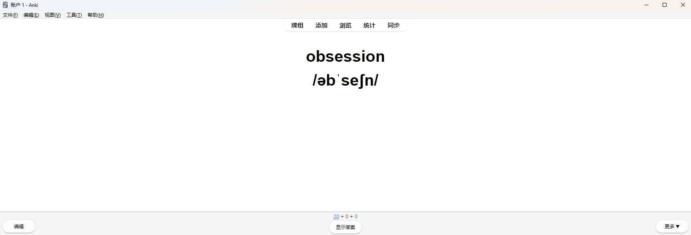
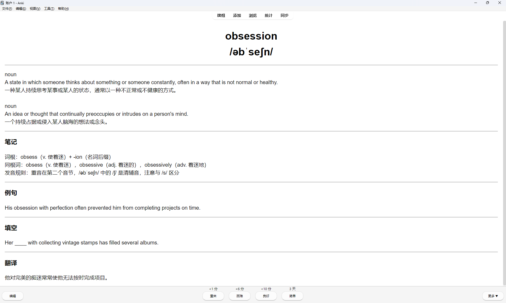
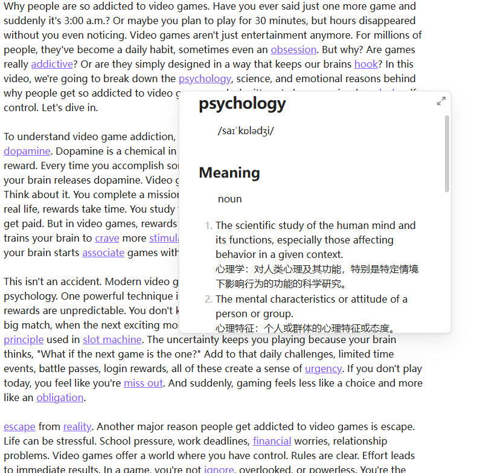
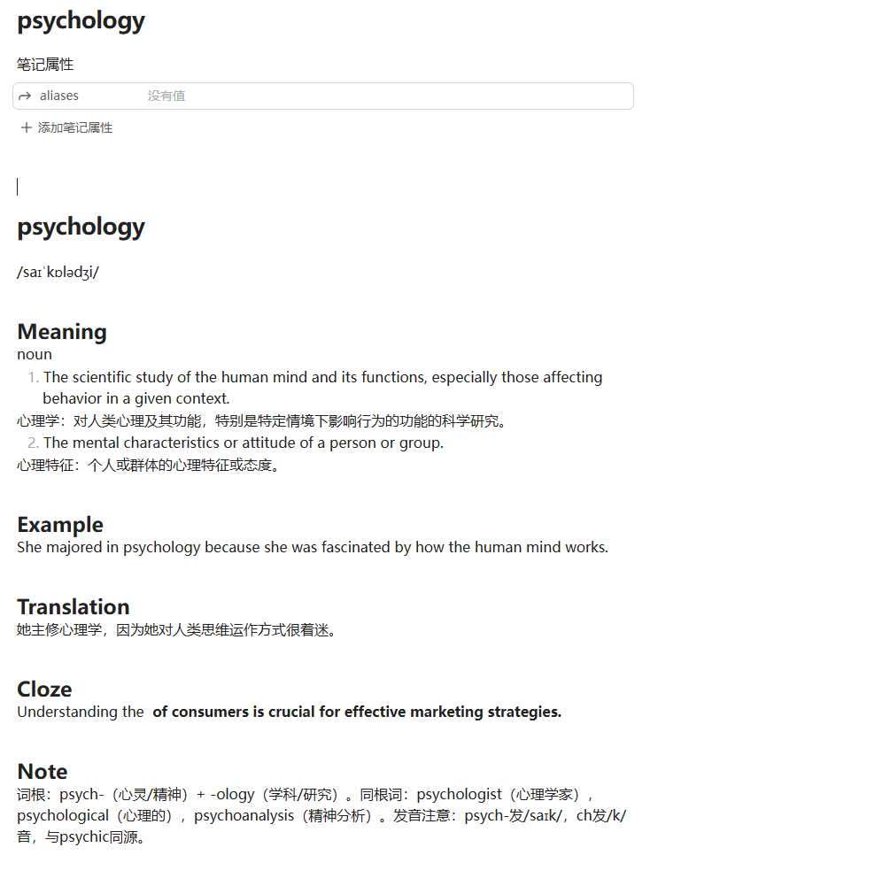

# Obsidian Anki Pipeline

一个将 **Obsidian 中的英文生词自动转换为 Anki 记忆卡片** 的工具。

核心目标：

> 把「阅读中遇到的生词」自动沉淀为「可复习的记忆」

---

# 📌 项目解决什么问题

在实际学习中，大多数人都会遇到这些情况：

### ❌ 常见问题

1. **阅读和记忆是割裂的**

   * 在 Obsidian 里做英文笔记 / 阅读
   * 生词只是“看过”，没有真正记住

2. **手动做 Anki 卡片成本太高**

   * 查词典
   * 复制粘贴
   * 写例句
   * 做 cloze
   * → 很容易放弃

3. **AI 工具不成体系**

   * 只能生成解释
   * 不能直接进入 Anki
   * 没有形成完整流程

---

# ✅ 本项目的思路

本项目做的不是“查词工具”，而是一个**学习流程自动化工具**：

```text
Obsidian（阅读/记录）
        ↓
标记生词（高亮/标注）
        ↓
AI 自动生成结构化内容
        ↓
导入 Anki
        ↓
通过间隔重复记忆
```

---

# 🧠 核心理念

> 不再“专门背单词”，而是让单词在阅读中自然积累

你只需要：

* 正常阅读
* 顺手标记生词

剩下的事情交给工具完成。

---

# ⚙️ 功能说明

## 1️⃣ 生词提取

从 Obsidian 笔记中提取：

* 特定标记（`==word==` ）的单词

---

## 2️⃣ AI 生成学习卡片

针对每个生词，自动生成：

* 单词原型（如 went → go）
* 词性（word / phrase）
* 中文释义（结合语境）
* 英文例句
* Cloze 填空句（用于 Anki）

---

## 3️⃣ 结构化输出

统一生成标准 JSON 数据，例如：

```json
{
  "word": "trigger",
  "type": "word",
  "meaning": "引发；触发",
  "example": "The news triggered a strong reaction.",
  "cloze": "The news {{c1::triggered}} a strong reaction."
}
```

---

## 4️⃣ 导入 Anki

支持：

* 通过 AnkiConnect API 自动导入
* 或导出为文件后手动导入

---

# 🚀 使用流程

## 步骤 1：在 Obsidian 中阅读 / 做笔记

例如：

```text
The news triggered a strong reaction.
```

对 `triggered` 做高亮标记：

```text
The news ==triggered== a strong reaction.
```

---

## 步骤 2：运行工具

执行：

```bash
dict.exe scan your_dir --provider=openai --model=LLM的模型名 --api-key=你的LLM的apikey --anki-deck=Anki中牌组名称 --anki-model=Anki中卡片模板

```
注意
- provider 可以选 openai 和 ollama，如果用openai兼容的在线AI就选择openai，用本地的模型就选用ollama，但是必须首先开启ollama
- model 选用的AI模型名称
- api-key 选择在线AI时，输入自己的apikey,选择本地模型不需要此参数
- anki-deck 导入Anki的牌组名称，必须要存在才能导入
- anki-model 导入Anki的笔记模板名称，必须是问答题类型的模板，否则会失败

工具会：

* 解析笔记
* 提取生词
* 调用 AI 生成卡片数据

---

## 步骤 3： Anki中复习

打开 Anki，即可看到生成的卡片，用于后续复习。




---
## 步骤 4： obsidian中复习

打开obsidian，所以被标记的单词都会在当前目录的dict目录下生成单独的释义文件，原先的英文笔记中 ==word== 已经被替换为链接，按住ctrl键，鼠标悬停到单词上可以弹出此单词的释义。

在obsidian中的阅读效果：



obsidian中生成的单独释义文件



---


# 🧩 适用人群

适合：

* 使用 Obsidian 做知识管理的人
* 有英文阅读习惯（技术文档 / 外刊 / 小说）
* 想用 Anki，但不想手动制卡的人

不太适合：

* 完全不使用 Obsidian
* 不打算使用 Anki 进行复习的人

---

# ⚙️ 可配置项

本项目支持一定程度的自定义：

* 生词提取规则
* AI Prompt 模板
* 卡片字段结构
* 是否生成 cloze
* 目标语言（中英/英英）

---

# 🛠️ 技术实现（简要）

整体流程：

```text
Obsidian 文件解析
        ↓
文本预处理
        ↓
调用 LLM（生成结构化 JSON）
        ↓
数据清洗与校验
        ↓
Anki 接口 / 文件导出
```

关键点：

* 使用结构化 Prompt，确保输出稳定
* 对词形进行还原（lemmatization）
* 控制生成内容格式，适配 Anki

---

# ⚠️ 注意事项

* AI 生成内容可能存在不准确情况，建议抽样检查
* Anki 需要安装并开启 AnkiConnect 插件（如使用自动导入）
* 生词标记方式需保持一致，否则可能无法识别

---

# 📌 项目定位

本项目不是：

* ❌ 背单词软件
* ❌ 翻译工具

而是：

> ✅ 一个将「阅读行为」转化为「记忆输入」的自动化工具

---

# 📎 后续可能扩展

* Obsidian 插件化（实时处理）
* 多语言支持
* 更丰富的卡片模板
* 阅读上下文增强

---

# 📝 总结

这个工具做的事情很简单：

```text
把你在 Obsidian 中“看到但记不住的单词”
变成 Anki 中“可以反复记住的卡片”
```

你只需要继续阅读，其余过程自动完成。
